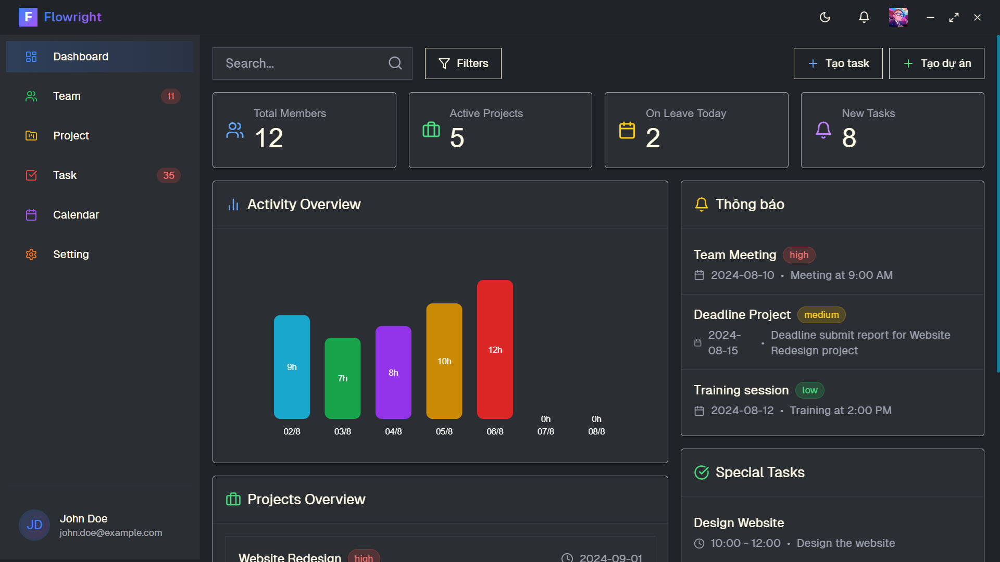
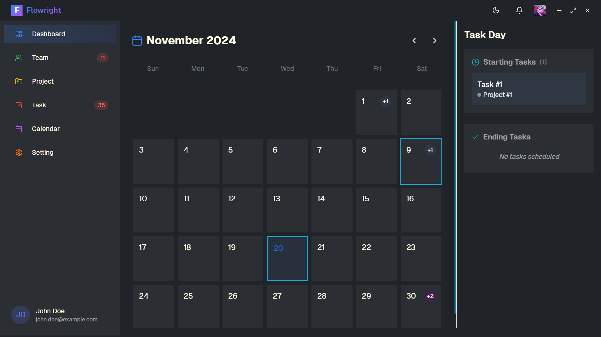
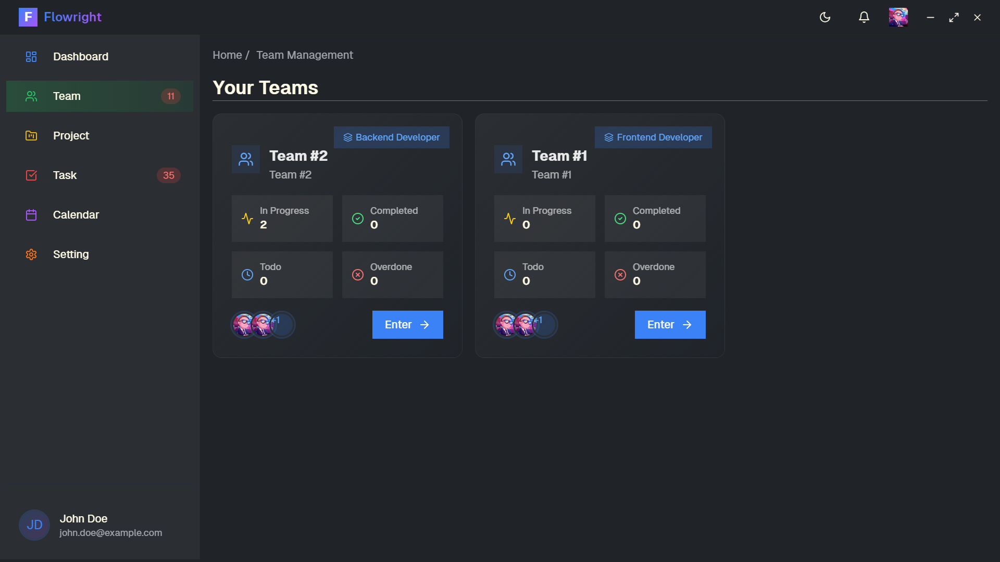
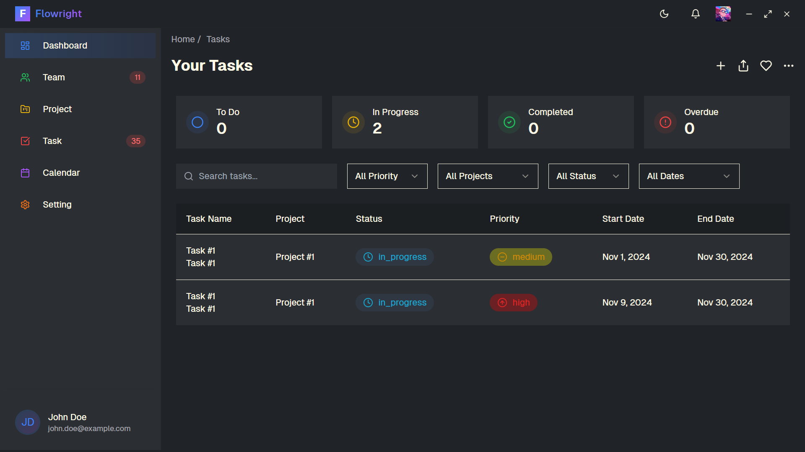

<div align="center">
  <h1>Flowright 🛡️</h1>
  <p><strong>A simple and powerful tool for managing task assets</strong></p>

  <p>
    
    
    
    
  </p>
</div>

## 📸 Screenshots

<div align="center">
  
  
</div>

## ✨ Key Features

- 🖥️ **Cross-platform**: Runs on Windows, macOS, and Linux
- 🎨 **Modern UI**: Minimalist design with Tailwind CSS and Shadcn UI
- 🌍 **Multilingual**: Multiple language support with i18next
- 📊 **Project Management**: Efficient task and project tracking
- 🔔 **Notifications**: Real-time updates on important activities
- 🌙 **Dark/Light Mode**: Customizable user interface themes

## 🛠️ Technology Stack

<details>
<summary><strong>Core 🏍️</strong></summary>

- [Electron 32](https://www.electronjs.org) - Desktop application framework
- [Vite 5](https://vitejs.dev) - Modern build tool
- [SWC](https://swc.rs) - Super-fast Rust-based compiler
</details>

<details>
<summary><strong>Frontend 🎨</strong></summary>

- [React](https://reactjs.org) - UI library
- [TypeScript](https://www.typescriptlang.org) - Typed JavaScript
- [Tailwind CSS](https://tailwindcss.com) - CSS framework
- [Shadcn UI](https://ui.shadcn.com) - Beautiful, reusable components
- [Framer Motion](https://www.framer.com/motion/) - Animation library
</details>

<details>
<summary><strong>Testing & Quality 🧪</strong></summary>

- [Jest](https://jestjs.io) - Unit testing
- [Playwright](https://playwright.dev) - E2E testing
- [ESLint](https://eslint.org) - Linting
- [Prettier](https://prettier.io) - Code formatting
</details>

## 📸 Screenshots

<div align="center" style="display: flex; flex-direction: row; gap: 10px;">
  <p>Dashboard</p>
  
  <p>Calendar</p>
  
  <p>Task Management</p>
  
  <p>Task</p>
  
</div>

## 🚀 Getting Started

1. Clone the repository:
```bash
git clone https://github.com/KhanhRomVN/soladal
```

2. Install dependencies:
```bash
npm install
```

3. Run the app:
```bash
npm run dev
```


## 📜 Available Scripts

| Command | Description |
|---------|-------------|
| `npm run start` | Start the app in development mode |
| `npm run package` | Package the app |
| `npm run make` | Create platform-specific installers |
| `npm run test` | Run unit tests |
| `npm run test:e2e` | Run E2E tests |
| `npm run storybook` | Launch Storybook |

## 🤝 Contributing

Contributions are welcome! Please read [CONTRIBUTING.md](CONTRIBUTING.md) for details.

## 📄 License

This project is licensed under the MIT License. See [LICENSE](LICENSE) for more information.

---

<p align="center">Made with ❤️ by <a href="https://github.com/KhanhRomVN">KhanhRomVN</a></p>
